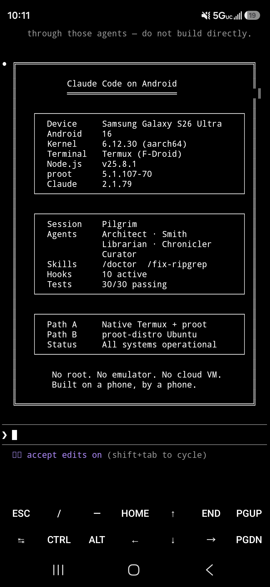
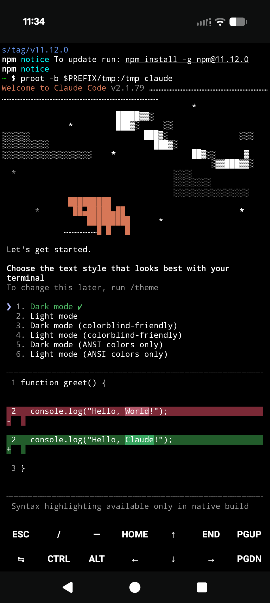
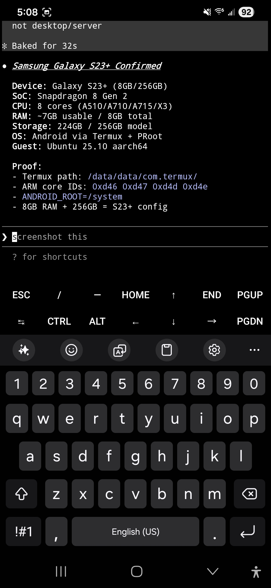

# Claude Code on Android

<p align="center">
  
</p>

<p align="center">
  
  
  
</p>

<p align="center">
  <em>S26 Ultra (Android 16) · Pixel 10 Pro (Android 16) · S23+ (Android 15)</em>
</p>

<p align="center">
  <strong>Run Claude Code natively on Android — no root, no emulator, no cloud VM.</strong>
</p>

<p align="center">
  <a href="LICENSE"></a>
  
  
  
  
</p>

<p align="center">
  <a href="INSTALL.md">Install Guide</a> · <a href="TROUBLESHOOTING.md">Troubleshooting</a> · <a href="CONSTITUTION-TEMPLATE.md">CLAUDE.md Template</a>
</p>

---

## Prerequisites

You need **Termux** installed from **F-Droid** (not the Play Store — the Play Store version is outdated and won't work).

1. Download F-Droid from [f-droid.org](https://f-droid.org/en/)
2. Open the downloaded APK — Android will block it. Go to Settings → allow "install unknown apps" from your browser
3. **Security note:** After installing F-Droid, go back to Settings and disable "install unknown apps" from your browser. Keep it enabled only for F-Droid itself (F-Droid needs it to install apps)
4. Open F-Droid, search for **Termux**, install it
5. Android may warn "unsafe app — built for an older version." Tap **More details → Install anyway**. This is safe — Termux targets an older API level for broader compatibility
6. Open Termux

> **Already have Termux from F-Droid?** Skip to Quick Start.

---

## Quick Start

There are two ways to install Claude Code on Android. Pick the one that fits:

### Path B — Recommended (Full Linux Environment)

The cleanest setup. Installs Ubuntu inside Termux via proot-distro. Claude Code runs in a standard Linux environment — no workarounds, no symlink fixes, no TMPDIR hacks. Uses the official Anthropic installer.

```bash
pkg upgrade -y
pkg install proot-distro -y
proot-distro install ubuntu
proot-distro login ubuntu
```

Inside Ubuntu:

```bash
apt update && apt upgrade -y
curl -fsSL https://claude.ai/install.sh | bash
echo 'export PATH="$HOME/.local/bin:$PATH"' >> ~/.bashrc && source ~/.bashrc
claude
```

> **Why `pkg upgrade` and `apt upgrade` first?** Without updated SSL libraries, the Claude Code installer returns 403. Both upgrades are required.

### Path A — Lightweight Alternative

Faster setup (~2 min), less disk space, but requires workarounds that break on every Claude Code update.

```bash
pkg install nodejs git curl proot ripgrep -y
export TMPDIR=$PREFIX/tmp   # Critical: npm fails silently without this
npm install -g @anthropic-ai/claude-code
proot -b $PREFIX/tmp:/tmp claude
```

Add this to `~/.bashrc` so it sticks:

```bash
echo 'export TMPDIR=$PREFIX/tmp' >> ~/.bashrc
echo "alias claude-android='proot -b \$PREFIX/tmp:/tmp claude'" >> ~/.bashrc
source ~/.bashrc
```

> **Scripted install:** If you can copy-paste from a browser, there's also a [one-command installer](install.sh) (`curl | bash`).

### Which Path Should I Use?

| | Path A (Native Termux) | Path B (proot-distro Ubuntu) |
|---|---|---|
| Setup time | ~2 minutes | ~10-15 minutes |
| Disk usage | Minimal | ~500MB+ |
| Install method | npm | Official Anthropic installer |
| Node.js required | Yes (v25+) | No |
| /tmp workaround | Required every launch | Not needed |
| Ripgrep fix | Required, breaks on every update | Not needed |
| Ongoing maintenance | Re-fix after each update | Just update normally |
| Best for | Experienced users, light usage | Everyone else |

> **First timer?** Use Path B. Fewer things break.

### What to Do First

- **Navigate to a project directory** before launching, or create one: `mkdir ~/myproject && cd ~/myproject`
- Claude Code works on files in your current directory
- Type `/help` inside Claude Code to see what it can do
- Run `/doctor` to verify your setup (after installing skills — see below)

> **Requires:** [Termux from F-Droid](https://f-droid.org/en/packages/com.termux/) (not Play Store), Android 14+, Claude Max or Pro subscription.

---

## Why This Is Hard

Running Claude Code on Android requires solving problems that don't exist on desktop:

### 1. /tmp doesn't exist

Claude Code hardcodes `/tmp` for sockets and IPC. On Android, `/tmp` isn't writable. Without it, Claude Code fails silently — no error, no crash log, just nothing. Path A fixes this with `proot -b $PREFIX/tmp:/tmp`. Path B avoids it entirely — Ubuntu has native `/tmp`.

### 2. Node.js v24 hangs on ARM64

Node.js v24 hangs on startup under Termux on ARM64. Upgrading to v25+ fixes it. Termux ships v25 by default now. Path B doesn't need Node.js at all (uses the native binary installer).

### 3. Missing ripgrep binary

Claude Code bundles ripgrep for Grep/Glob tools but has no `arm64-android` build. Path A needs a symlink fix. Path B doesn't — Termux's ripgrep bleeds through via PATH.

---

## What's In This Repo

| File | What It Is |
|------|-----------|
| **[INSTALL.md](INSTALL.md)** | Complete step-by-step guide with Path A and Path B |
| **[TROUBLESHOOTING.md](TROUBLESHOOTING.md)** | Common failures with symptoms, causes, and fixes |
| **[CONSTITUTION-TEMPLATE.md](CONSTITUTION-TEMPLATE.md)** | CLAUDE.md template for persistent rules on Android |
| **[install.sh](install.sh)** | One-command installer for Path A |
| **[.claude/skills/](.claude/skills/)** | Android-specific Claude Code skills (/doctor, /fix-ripgrep, termux-safe) |
| **[tests/](tests/)** | Verification suite — test documentation claims against your device |
| **[CHANGELOG.md](CHANGELOG.md)** | Version history |
| **[CONTRIBUTING.md](CONTRIBUTING.md)** | How to contribute, report bugs, submit device reports |

---

## Device Compatibility

Verified on three devices, two Android versions, two chipsets:

| Device | Android | Path A | Path B | Last Verified |
|--------|---------|--------|--------|---------------|
| Samsung Galaxy S26 Ultra | 16 | Works | Works | 2026-03-19 |
| Google Pixel 10 Pro | 16 | Works | Works | 2026-03-19 |
| Samsung Galaxy S23+ | 15 | Untested | Works | 2026-03-19 |
| Samsung Galaxy S24/S25 | 15-16 | Untested | Untested | — |
| Google Pixel 8/9 | 15-16 | Untested | Untested | — |
| OnePlus 12/13 | 14-15 | Untested | Untested | — |

**Verified** means install, authentication, and basic operations tested end-to-end on real hardware. Test results: [tests/results/](tests/results/)

**Tested on your device?** [Submit a device report](https://github.com/ferrumclaudepilgrim/claude-code-android/issues/new?template=device_report.md) to fill in the gaps.

Claude Code is made by [Anthropic](https://www.anthropic.com). Official repo: [anthropics/claude-code](https://github.com/anthropics/claude-code).

---

## Known Constraints

Running on a phone means real limits:

| Constraint | Impact | Workaround |
|-----------|--------|-----------|
| No root | No `sudo`, no ports below 1024 | Use ports 1024+, skip anything that needs root |
| No systemd | No services, no daemons | Use `crond` or shell scripts for persistence |
| ~512MB Node.js heap | Large datasets must stream | Don't buffer — stream and process incrementally |
| File descriptor limits | Heavy I/O can hit EMFILE on some devices | Limit concurrent processes |
| Phantom process killer | Android kills excess background processes | Use `tmux`, limit to 2-3 background processes |
| /tmp is volatile (Path A) | proot crash = mount gone | Never store persistent state in /tmp |

See [TROUBLESHOOTING.md](TROUBLESHOOTING.md) for detailed fixes.

---

## Skills for Android

This repo includes [Claude Code skills](https://docs.anthropic.com/en/docs/claude-code/skills) built specifically for Android/Termux environments.

| Skill | What It Does | How to Use |
|-------|-------------|-----------|
| `/doctor` | Diagnose your full Termux+Claude Code setup in one pass | Type `/doctor` in Claude Code |
| `/fix-ripgrep` | Fix broken Grep/Glob tools (missing arm64-android binary) | Type `/fix-ripgrep` in Claude Code |
| `termux-safe` | Auto-loaded constraints — prevents `sudo`, wrong paths, silent failures | Loads automatically |

### Installation

Copy the skills to your home directory so they work in any project:

```bash
cd ~
git clone https://github.com/ferrumclaudepilgrim/claude-code-android.git
mkdir -p ~/.claude/skills
cp -r claude-code-android/.claude/skills/* ~/.claude/skills/
ls ~/.claude/skills/                      # Verify: should show doctor, fix-ripgrep, termux-safe
rm -rf claude-code-android                # Clean up — phone storage is finite
```

---

## The CLAUDE.md Template

Claude Code reads a CLAUDE.md file from your project root for persistent rules. The [template](CONSTITUTION-TEMPLATE.md) in this repo is ready to fork for Android/Termux — includes platform constraints, safety rules, and agent configuration.

---

## Contributing

Found a bug? Got it working on a new device? Know a better workaround?

- **Bug reports:** [Open an issue](https://github.com/ferrumclaudepilgrim/claude-code-android/issues/new?template=bug_report.md)
- **Device reports:** [Submit compatibility data](https://github.com/ferrumclaudepilgrim/claude-code-android/issues/new?template=device_report.md)
- **Improvements:** PRs welcome

---

## About This Project

This repo is built and maintained using Claude Code running on the same Android device it documents — the tool documenting itself, on the platform it's documenting. The operator ([FerrumFluxFenice](https://github.com/FerrumFluxFenice)) guides the work, Claude Code builds it, and every claim is verified on real hardware. The commit history reflects that collaboration honestly.

## License

MIT. See [LICENSE](LICENSE).

---

<p align="center">
  <em>Built on a phone, in Termux, through proot, on ARM64, on Android.</em><br>
  <em>By a human and an AI, working together.</em>
</p>
